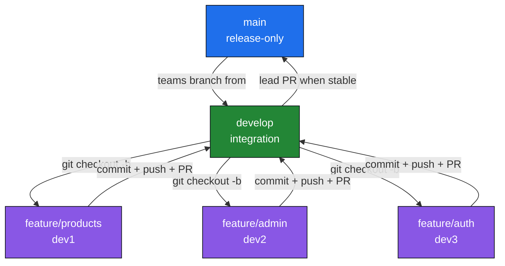
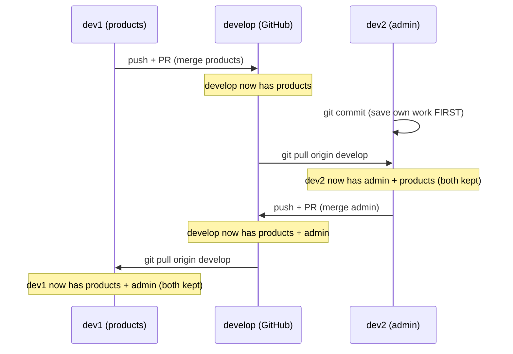

# Contributing Guide — Miraki

This guide explains **how our 3 teams work together** on the same repository without
overwriting each other's code. Read this before you write a single line.

**Repo:** `https://github.com/tinytiaraa569/Miraki-.git`

---

## 1. The Golden Rules (read these first)

1. **Never work directly on `main` or `develop`.** Always create a `feature/*` branch.
2. **Always branch off `develop`**, not `main`.
3. **Always open Pull Requests into `develop`**, never into `main`.
4. **Commit your work BEFORE you pull.** Committed work can never be lost by a pull.
5. **Never use `git push --force` or `git reset --hard`** unless you know exactly why.
6. **Pull often** (`git pull origin develop`) so conflicts stay small.

---

## 2. Branch Structure

| Branch        | Purpose                                        | Stability      | Who touches it            |
| ------------- | ---------------------------------------------- | -------------- | ------------------------- |
| `main`        | Release / production-ready code                | Rock solid     | Lead only (via PR)        |
| `develop`     | Integration branch where all teams' work meets | Mostly stable  | Everyone (via PR only)    |
| `feature/*`   | One team building one feature                  | Can be messy   | One developer / team      |

```
feature/*   →   develop   →   main
(your work)    (staging)     (release)
```

### Branch naming convention

```
feature/products      feature/admin       feature/auth
bugfix/cart-total     hotfix/login-crash
```

---

## 3. The Flow (visual)



---

## 4. One-Time Setup (each developer, once)

> Use `git clone` — **never** "Download ZIP". A ZIP has no `.git` folder, so Git commands fail.

```bash
git clone https://github.com/tinytiaraa569/Miraki-.git
cd Miraki-
git branch          # confirm you see "* main"
```

Verify everything is connected:

```bash
git status          # "On branch main"
git remote -v       # shows the GitHub URL (fetch + push)
```

---

## 5. Daily Workflow (do this EVERY feature)

### Step 1 — Start from the latest `develop`

```bash
git checkout develop
git pull origin develop
git checkout -b feature/products     # your own branch
```

### Step 2 — Do your work, then save it

```bash
git status                           # see what changed
git add .                            # stage everything (modified + new files)
git commit -m "Add products module"  # save a checkpoint
```

### Step 3 — Push your branch to GitHub

```bash
git push -u origin feature/products  # first push (sets upstream)
git push                             # every push after that
```

### Step 4 — Open a Pull Request

1. Go to the repo on GitHub → click **"Compare & pull request"**.
2. ⚠️ **Set base = `develop`** (GitHub often defaults to `main` — change it!).
3. Add a title + description → **Create pull request**.
4. Wait for **CI** to pass (✅ green). Fix and re-push if it's ❌ red.
5. Get a review → click **"Merge pull request"**.

---

## 6. How dev1 and dev2 Exchange Code

Developers **never** send code directly to each other. They push to `develop`
(the "post office"), and the other pulls from `develop`.



### To SHARE your code (giving)

```bash
git add .
git commit -m "..."
git push
# → open PR into develop → merge
```

### To RECEIVE others' code (getting)

```bash
git add .
git commit -m "save my work first"   # IMPORTANT: commit before pulling
git pull origin develop              # merges others' code INTO your branch
```

**Push + PR = giving. Pull = receiving.** Nobody loses work because Git *combines*
changes instead of overwriting them.

---

## 7. Resolving Merge Conflicts

A conflict only happens when two people edit the **same lines in the same file**.
Git will not guess — it shows you both versions:

```js
<<<<<<< HEAD
app.use("/admin", adminRoutes)        // YOUR code
=======
app.use("/products", productRoutes)   // code from develop
>>>>>>> develop
```

**How to fix:** delete the markers and keep what you need (usually both):

```js
app.use("/admin", adminRoutes)
app.use("/products", productRoutes)
```

Then finish the merge:

```bash
git add app.js
git commit -m "Resolve conflict: keep both routes"
git push
```

Nothing is lost — Git literally shows both versions and lets you keep both.

---

## 8. Avoiding Conflicts on Shared Files (like `app.js`)

Instead of everyone editing `app.js`, use a **central router** so each team edits
its own file:

```js
// routes/index.js — each team registers ONE line here
const router = require("express").Router()

router.use("/products", require("./products"))   // dev1
router.use("/admin", require("./admin"))          // dev2
router.use("/auth", require("./auth"))            // dev3

module.exports = router
```

```js
// app.js — this file never changes again
app.use("/api", require("./routes"))
```

Keep modules in separate folders so teams rarely touch the same files:

```
src/
  modules/
    products/     ← dev1
    admin/        ← dev2
    auth/         ← dev3
  shared/         ← coordinate before editing
```

---

## 9. Cutting a Release (`develop` → `main`)

Only a **lead** does this, when `develop` is stable and tested:

1. Open a PR: **base = `main`**, compare = `develop`.
2. CI runs → review → **Merge**.
3. `main` now holds a clean, tested snapshot of everyone's work.

---

## 10. Command Cheat Sheet

| Goal                              | Command                                             |
| --------------------------------- | --------------------------------------------------- |
| Get latest integration code       | `git checkout develop && git pull origin develop`  |
| Start a new feature               | `git checkout -b feature/xyz`                       |
| See what changed                  | `git status` / `git diff`                           |
| Save your work                    | `git add .` → `git commit -m "message"`             |
| Upload your branch                | `git push -u origin feature/xyz` (then `git push`)  |
| Receive others' merged work       | `git pull origin develop` (on your branch)          |
| Fix a conflict                    | edit file → `git add file` → `git commit`           |
| See combined history              | `git log --oneline`                                 |

---

## 11. What NOT to commit

Make sure these are in `.gitignore` and never pushed:

```
node_modules/
.env
.env.local
dist/
build/
```

If `git status` shows `node_modules` or `.env`, stop and add a `.gitignore` first.

---

**In one line:** branch from `develop` → commit → push → PR into `develop`; run
`git pull origin develop` to receive others' work. Commit before you pull and nobody
ever loses code.
